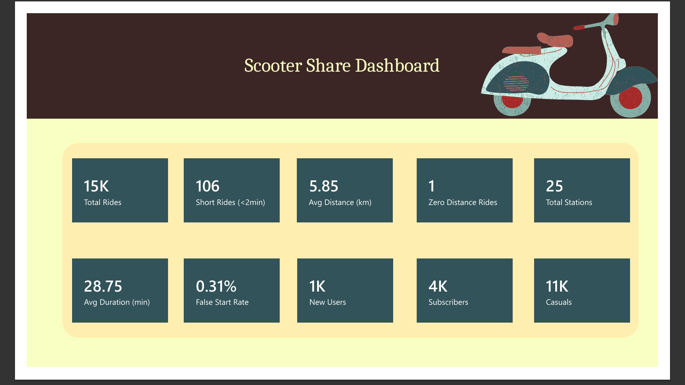
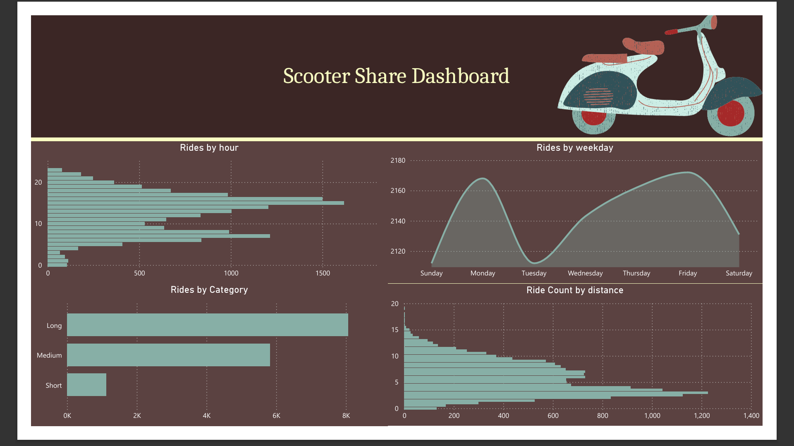

# Scooter-Share Ride Analytics & Retention Dashboard

## Overview
Analysis of a scooter-share operator's ride, station, and user data to surface 
data quality issues, ride behavior patterns, and user growth/retention trends.

## Data
Three linked tables: `rides`, `stations`, `users` (SQL Server).

## What I Did
- Audited data quality: missing values, false starts (near-zero duration/distance rides)
- Computed ride-duration and distance summary statistics
- Categorized rides into Short/Medium/Long and analyzed by membership level
- Identified peak usage hours and top/bottom performing stations by net flow
- Modeled monthly user signups and month-over-month growth using window functions
- Built a 6-page interactive Power BI dashboard with 14 custom DAX measures

## Tools
SQL Server, Power BI, DAX, Power Query

## Dashboard Preview

### Overview

### Ride Quality & Duration

## Files
- `Scooter_query.sql` — all analysis queries
- `Scooter_Analysis_Dashboard.pbix` — Power BI report file
